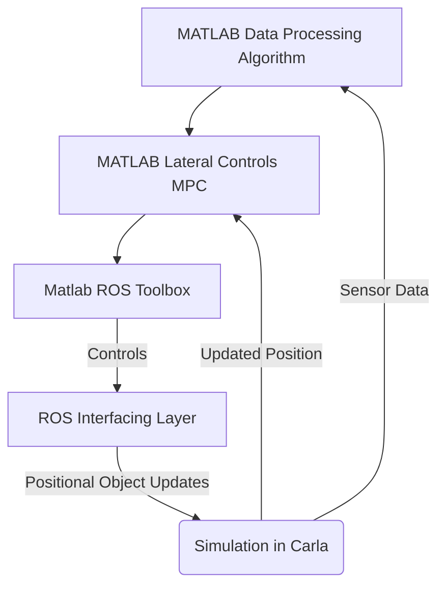

# CS 560: Lane Line Detection

## Abstract (To Be Added)

## Introduction
&emsp;One of the most pressing challenges faced in the journey to self-driving cars, is lane detection. While identifying roads is a trivial task for humans, it is a far more difficult task for autonomous vehicles. The goal of lane line detection is primarily to serve as a path planning tool as well as a safety tool for lateral control systems in autonomous vehicles. There are many obstacles that must be overcome when implementing such a system, including the different road line types, edges without lines, different road materials, lighting conditions, and environmental hazards. Implementing a system that takes into account these factors is crucial, so that a high enough safety threshold can be achieved to make the system a viable product. 

&emsp;The purpose of this project is to identify the best sensors to use for lane line detection for UA's EcoCAR team. The CAV (Connected Autonomous Vehicles) subteam is focused on developing autonomous features for the car, including lateral controls based on lane line detection. The modified car, a 2023 Cadillac Lyriq has several limitations that must be taken into account. First, there is a total limit of the compute resources and power draw that can be used, as a result of the EcoCAR competition's rules. Second, complexity must be taken into account, as a less complex system is necessary in order to ensure that the algorithm can be easily debugged and integrated with other systems that need lateral controls like the autonomous intersection navigation and auto park algorithms. Finally, the lateral controls must be robust enough to stand up to the vehicle technical specifications, including at least a 99% accuracy with lane detection and path planning. Choosing the right sensor for this problem is thus critical for the success of the team's work on lateral control algorithms.

&emsp;There are two main sensors used for the purpose of detecting lane lines, front facing cameras and LiDARs. Front facing cameras, use edge detection from images to track lane lines, whereas LiDARs use the differences in the reflection from lane lines and the road to detect the lane lines. Each method comes with its own strengths and drawbacks.

&emsp;LiDAR sensors are sensors that measure the time light takes to bounce off of an object to generate data. LiDAR is a time of flight (TOF) sensor, which in effect means the data received from the sensor is a 3d map of the environment. When LiDAR is used for lane line detection, it relays accurate information about the distance of the data it receives, which allows for better path planning. LiDAR works well in a variety of lighting conditions, which also makes it a good choice for lane line detection. LiDAR sensors also have some drawbacks. One chief problem with LiDAR sensors is that they generate a large volume of data to be processed every second, this in effect means that they require large amounts of computing power to be used effectively. They also are very expensive, creating a barrier to entry for cheaper automotive systems. LiDAR sensors also have key issues with weather effects that limit light travel, making them a poor choice in adverse weather conditions like fog. 

&emsp;Forward facing cameras, are often situated on the front of vehicles, either integrated into the grill, or attached where the rearview camera is. Forward facing cameras use computer vision algorithms for edge detection to identify lane lines. While this means they need a large amount of compute power for training, they typically need far less for inferencing. Forward facing cameras are also capable of depth perception, but in order for that to work, two cameras are need to be set up in stereo to calculate distances. Cameras work well with an unobstructed line of sight and are far cheaper than LiDARs which is a major advantage to them. They have more difficulties in low light environments than LiDARs, and also struggle in adverse weather conditions. 

&emsp;The option to use multiple technologies also exists, but it comes with a few drawbacks specific to the operational design domain. The CAV compute platform has a maximum energy draw, and the resources must be used by other algorithms like the sensor fusion algorithms. Thus, an analysis of the strain on resources must be taken into account in the decision-making process. Additionally, considerations must be made in accordance to the added cost per increase in effectiveness by implementing a mixed approach from both a developmental and hardware perspective.
## Related Works
#### Development and Validation of ADAS Perception Application in ROS Environment Integrated with CARLA Simulator:
&emsp; This paper focused on the development of LiDAR based ADAS (Advanced Driver Assistance Systems) using ROS and CARLA. ROS is a suite of tools for developing and robotics applications. In this context, the use of ROS is used for sensor data manipulation and for the actual controls of the vehicle. CARLA is an open source simulation tool for vehicles. It provides high fidelity simulation and has a bridge to ROS that can be used for a two-way stream of data. This paper was used as it provides valuable information for the architecture of this project and guidance on tools that can be used to approach the task. This paper however doesn't focus much on the actual algorithms and focuses on broader ADAS systems than lane line detection for lateral controls.
https://ieeexplore.ieee.org/document/8971063
#### Lane detection and tracking via Matlab:
&emsp; This paper addresses algorithms for the use of camera data to detect lane lines. This paper uses MATLAB with complex filtering techniques to distill images into a format that can be parsed for lane line data. The control flow for this paper was using MATLAB for all the processing and then an interfacing layer for ROS to and using the ROS toolbox to get outputs in Gazebo. The actual algorithm is the edge detection from the image for lane lines, and then there is a secondary component of path planning and controls. The parts of this paper that will be used are the use of MATLAB with an intermediary layer before the simulator. This will be done due to the wide array of image and data processing tools available in MATLAB along with its various visualization methods. The actual image detection algorithm will also be partially utilized, specifically the use of RANSAC (Random Sample Consensus) along with the parameters chosen on the images to help find lane lines.
https://pure.tue.nl/ws/portalfiles/portal/297651227/1438581_BEP.pdf
#### Real time object detection using LiDAR and camera fusion for autonomous driving
&emsp; This paper discusses the use of a fusion methodology for LiDAR and forward facing cameras for the purpose of detecting lane lines. This approach attempts to use the positive attributes of both to eliminate problems, but does result in high amounts of complexity. This paper uses YOLO-5 for the LiDAR processing which is a suitable option, but has a high amount of compute overhead. The main takeaway from this paper is the strategy for the hybrid methodology, along with some strategies for parsing complex LiDAR point clouds.
https://www.nature.com/articles/s41598-023-35170-z
## Approach
*This section will be further completed as implementation is worked on

This project will be run from a Simulink model. The model will call a script to open CARLA and the ROS connection. The Simulink model will also handle a large majority of the data flow. It will have a selector for the three different MATLAB Data Processing Algorithms to choose from: Camera, LiDAR, and Hybrid. It will then run the simulations and collect test data, and the accuracy of the data based on the actual path.

The approach is based on the following steps:
1. **The Environment Setup**

This graph walks through the basic data streams for the environment setup. 
Here is the documentation that will be used to set this up:
https://www.mathworks.com/help/ros/ug/set-up-and-connect-to-carla-simulator.html
https://www.mathworks.com/help/ros/ug/emergency-braking-of-ego-vehicle-in-carla-using-simulink.html
https://carla.readthedocs.io/projects/ros-bridge/en/latest/ros_installation_ros2/

2. **The Controls Algorithm**
The controls algorithm is going to be handled with the MPC block in MATLAB with some basic path planning logic. The documentation for the MPC is here: https://www.mathworks.com/help/mpc/ug/lane-keeping-assist-system-using-model-predictive-control.html
The documentation for MATLAB lateral controls and for path planning is here: https://www.mathworks.com/help/driving/ug/lateral-control-tutorial.html
3. **Camera based detection**
This is some documentation for the camera algorithm in MATLAB: https://www.mathworks.com/help/visionhdl/ug/lane-detection.html
Here is documentation for other lane detection algorithms:
https://towardsdatascience.com/computer-vision-for-lane-finding-24ea77f25209
4. **LiDAR based detection**
This is some documentation for the LiDAR based approach:
https://www.mathworks.com/help/lidar/ug/lane-detection-in-3d-lidar-point-cloud.html
5. **Hybrid based detection**
This is some discussion of the hybrid approach:
http://rvsn.csail.mit.edu/Pubs/phd_ashuang_2010feb_laneestimation.pdf
6. **Tests**
Here is documentation for simulink testing in MATLAB:
https://www.mathworks.com/help/sltest/test-execution.html

## Assumptions (To Be Added)
## Results (To Be Added)
## Conclusion (To Be Added)
## Link to presentation video (To Be Added)

