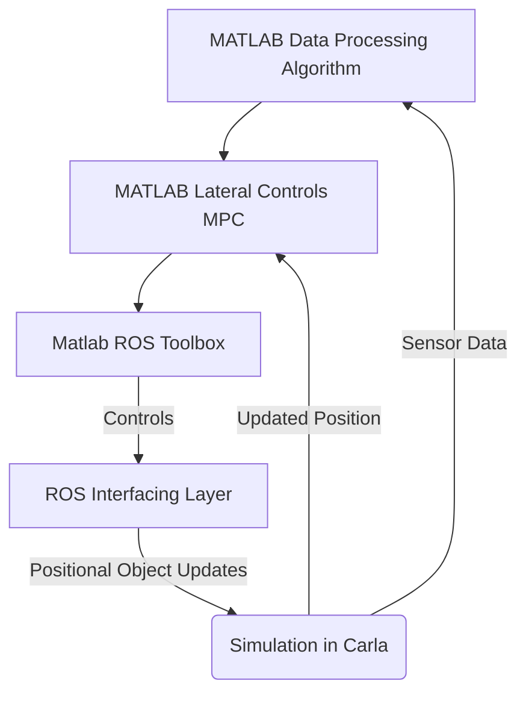

# CS 560: Lane Line Detection
### Sahuj Mehta
---
## Abstract
&emsp; Lane line detection is a pivotal component in the development of autonomous vehicles, serving as a a path planning tool to enable lateral controls. The task itself is difficult in comparison to autnomous longitudinal controls which have been around since 1999 in the form of daptive cruise control. This project was undertaken on behalf of UA's EcoCAR team focusing specifically on evaluating sensors and implementing lane centering for a 2023 Cadillac Lyriq. Considering the computational constraints of the team added hardware and the budghe, the project evaluates the feasibility of utilizing front facing cameras and LiDAR sensors for the task. The study also investigates a hybrid approach in which the two are both cameras and LiDARs are used. The analysis was conducted using MATLAB, Simulink, CARLA, and ROS. MATLAB and Simulink were used for the car's logic, CARLA to simulate the car, and ROS served as the bridge between them. There performance was evaluated using MATLAB performance profiler along with simulation results. The ultimate conclusion of the project was that unless there is a specific other need for a LiDAR, using a camera would be the most efficent method in terms of both cost and also computational complexity.

## Introduction
&emsp;One of the most pressing challenges faced in the journey to self-driving cars, is lane detection. While identifying roads is a trivial task for humans, it is a far more difficult task for autonomous vehicles. The goal of lane line detection is primarily to serve as a path planning tool as well as a safety tool for lateral control systems in autonomous vehicles. There are many obstacles that must be overcome when implementing such a system, including the different road line types, edges without lines, different road materials, lighting conditions, and environmental hazards. Implementing a system that takes into account these factors is crucial, so that a high enough safety threshold can be achieved to make the system a viable product. 

&emsp;The purpose of this project is to identify the best sensors to use for lane line detection for UA's EcoCAR team. The CAV (Connected Autonomous Vehicles) subteam is focused on developing autonomous features for the car, including lateral controls based on lane line detection. The modified car, a 2023 Cadillac Lyriq has several limitations that must be taken into account. First, there is a total limit of the compute resources and power draw that can be used, as a result of the EcoCAR competition's rules. Second, complexity must be taken into account, as a less complex system is necessary in order to ensure that the algorithm can be easily debugged and integrated with other systems that need lateral controls like the autonomous intersection navigation and auto park algorithms. Finally, the lateral controls must be robust enough to stand up to the vehicle technical specifications, including at least a 99% accuracy with lane detection and path planning. Choosing the right sensor for this problem is thus critical for the success of the team's work on lateral control algorithms.

&emsp;There are two main sensors used for the purpose of detecting lane lines, front facing cameras and LiDARs. Front facing cameras, use edge detection from images to track lane lines, whereas LiDARs use the differences in the reflection from lane lines and the road to detect the lane lines. Each method comes with its own strengths and drawbacks.

&emsp;LiDAR sensors are sensors that measure the time light takes to bounce off of an object to generate data. LiDAR is a time of flight (TOF) sensor, which in effect means the data received from the sensor is a 3d map of the environment. When LiDAR is used for lane line detection, it relays accurate information about the distance of the data it receives, which allows for better path planning. LiDAR works well in a variety of lighting conditions, which also makes it a good choice for lane line detection. LiDAR sensors also have some drawbacks. One chief problem with LiDAR sensors is that they generate a large volume of data to be processed every second, this in effect means that they require large amounts of computing power to be used effectively. They also are very expensive, creating a barrier to entry for cheaper automotive systems. LiDAR sensors also have key issues with weather effects that limit light travel, making them a poor choice in adverse weather conditions like fog. 

&emsp;Forward facing cameras, are often situated on the front of vehicles, either integrated into the grill, or attached where the rearview camera is. Forward facing cameras use computer vision algorithms for edge detection to identify lane lines. While this means they need a large amount of compute power for training, they typically need far less for inferencing. Forward facing cameras are also capable of depth perception, but in order for that to work, two cameras are need to be set up in stereo to calculate distances. Cameras work well with an unobstructed line of sight and are far cheaper than LiDARs which is a major advantage to them. They have more difficulties in low light environments than LiDARs, and also struggle in adverse weather conditions. 

&emsp;The option to use multiple technologies also exists, but it comes with a few drawbacks specific to the operational design domain. The CAV compute platform has a maximum energy draw, and the resources must be used by other algorithms like the sensor fusion algorithms. Thus, an analysis of the strain on resources must be taken into account in the decision-making process. Additionally, considerations must be made in accordance to the added cost per increase in effectiveness by implementing a mixed approach from both a developmental and hardware perspective.
## Related Works
#### Development and Validation of ADAS Perception Application in ROS Environment Integrated with CARLA Simulator:
&emsp; This paper focused on the development of LiDAR based ADAS (Advanced Driver Assistance Systems) using ROS and CARLA. ROS is a suite of tools for developing and robotics applications. In this context, the use of ROS is used for sensor data manipulation and for the actual controls of the vehicle. CARLA is an open source simulation tool for vehicles. It provides high fidelity simulation and has a bridge to ROS that can be used for a two-way stream of data. This paper was used as it provides valuable information for the architecture of this project and guidance on tools that can be used to approach the task. This paper however doesn't focus much on the actual algorithms and focuses on broader ADAS systems than lane line detection for lateral controls.
https://ieeexplore.ieee.org/document/8971063
#### Lane detection and tracking via Matlab:
&emsp; This paper addresses algorithms for the use of camera data to detect lane lines. This paper uses MATLAB with complex filtering techniques to distill images into a format that can be parsed for lane line data. The control flow for this paper was using MATLAB for all the processing and then an interfacing layer for ROS to and using the ROS toolbox to get outputs in Gazebo. The actual algorithm is the edge detection from the image for lane lines, and then there is a secondary component of path planning and controls. The parts of this paper that will be used are the use of MATLAB with an intermediary layer before the simulator. This will be done due to the wide array of image and data processing tools available in MATLAB along with its various visualization methods. The actual image detection algorithm will also be partially utilized, specifically the use of RANSAC (Random Sample Consensus) along with the parameters chosen on the images to help find lane lines.
https://pure.tue.nl/ws/portalfiles/portal/297651227/1438581_BEP.pdf
#### Real time object detection using LiDAR and camera fusion for autonomous driving
&emsp; This paper discusses the use of a fusion methodology for LiDAR and forward facing cameras for the purpose of detecting lane lines. This approach attempts to use the positive attributes of both to eliminate problems, but does result in high amounts of complexity. This paper uses YOLO-5 for the LiDAR processing which is a suitable option, but has a high amount of compute overhead. The main takeaway from this paper is the strategy for the hybrid methodology, along with some strategies for parsing complex LiDAR point clouds.
https://www.nature.com/articles/s41598-023-35170-z
## Approach
*This section will be further completed as implementation is worked on

This project will be run from a Simulink model. The model will call a script to open CARLA and the ROS connection. The Simulink model will also handle a large majority of the data flow. It will have a selector for the three different MATLAB Data Processing Algorithms to choose from: Camera, LiDAR, and Hybrid. It will then run the simulations and collect test data, and the accuracy of the data based on the actual path.

The approach is based on the following steps:
1. **The Environment Setup**

This graph walks through the basic data streams for the environment setup. 

In order to replicate the setup, follow these steps:

I) Note this will only work on Windows since CARLA isn't supported for Mac OS

II) Install CARLA 9.13 (https://carla.org/2021/11/16/release-0.9.13/) The world file is included in Carla (Town 3)

III) Install VMware Workstation 17 Player (https://www.vmware.com/go/getplayer-win)

IV) Install Mathworks Noetic VM (https://www.mathworks.com/support/product/robotics/ros2-vm-installation-instructions-v9.html)

V) Install Matlab R2023B, Simulink, ROS Toolbox, Automated Driving Toolbox, Image Processing Toolbox, Computer Vision Toolbox (https://login.mathworks.com/embedded-login/landing.html?cid=getmatlab&s_tid=gn_getml)

VI) Download this repository

VII) Open the Mathworks VM using VMware Player

VIII) On the VM open ROS Noetic Core Terminal and write down the ROS_MASTER_URI

IX) On the VM open ROS Noetic Terminal and run this command `~/carla-ros-bridge/catkin_ws/devel/setup.bash`

X) On the Terminal from step 8 use this command `roslaunch carla_ros_bridge carla_ros_bridge_with_ego_vehicle.launch host:=192.168.X.X timeout:=60000 town:='Town03' spawn_point:=-100,-250,0.5,0,0,0' and replace the launch host IP address with the address of the host computer

XI) Open the code from this repository in Matlab. Replace the IP address with the URI from step 8 and run the launch script

XII) When the simulink model opens, run it to start the simulation

2. **The Controls Algorithm**
The control algorithm used for movement was an MPC. Simulink has a basic block for a model predictive controller and this was utilized alongside a 2 Degree of Freedom Bicycle model for the lateral controls scheme. The prediction and control horizons were set using previous data from the team. The weights for the objective function were arbitrarily selected since the tuning of the lateral MPC was not assessed in this project. The MPC wasn't tuned which could have been a source for error, and will be considered as these algorithms are actually implemented on the team's hardware in a HIL setup.

The basic documentation for the MPC is here: https://www.mathworks.com/help/mpc/ug/lane-keeping-assist-system-using-model-predictive-control.html
The documentation for MATLAB lateral controls and for path planning is here: https://www.mathworks.com/help/driving/ug/lateral-control-tutorial.html
Internal team documentation was also used for the creation of this controller.

3. **Camera based detection**
The camera based detection algorithm, reads in a video frame. It then converts the frame to gray scale and fits a gaussian blur to reduce noise. The canny function is then used in Matlab to identify edges based on the image. A region of interest is then generated using polygon generation and a mask to reduce the lines to the place that they were expected to be. The hough transform function is then used to detect the lane lines in the image. The direction of the lane lines are interpolated to create a rudimentary trajectory that is then sent as a steering angle to the MPC to make adjustments.

This is some documentation for a camera based lane line detection algorithm in MATLAB: https://www.mathworks.com/help/visionhdl/ug/lane-detection.html
Here is documentation for another lane detection algorithm that was utilized: https://towardsdatascience.com/computer-vision-for-lane-finding-24ea77f25209

4. **LiDAR based detection**
The LiDAR approach is limited in scope. The first step is to get a point cloud from the sensor on the Car. Then the noise is filtered out using a spatial filter. The data is then projected onto an XY plane before being turned into a binary image. The hough transform is once again used to identify the lane lines in the image. With the basic lane lines detected, they are sent to the trajectory function to calculate a predicted trajectory based on the lines. The trajectory is then outputted as a steering angle to the MPC to control the steering of the car.

This is some documentation for the LiDAR based approach:
https://www.mathworks.com/help/lidar/ug/lane-detection-in-3d-lidar-point-cloud.html

5. **Hybrid based detection**
While initially it was intended to be a complex approach to the problem using machine learning to calculate lane lines based on the data to create a joint trajectory of a probablistic nature, due to the time constraints this was not implemented. In the spirit of the project, where the goal was simply to identify the good and bad aspects of each algorithm, a shift was made to create a hybrid algorithm that simply used both individual algorithms and then merged and smoothed the trajectories to get a heading. While it was intially intended to be a high complexity difficult algorithn, the new approach serves as a better indicator of the strengths and weaknesses of the approach as a whole and less of a look at one very specific hybrid approach.
This is some documentation of the hybrid approach that was intially intended:
http://rvsn.csail.mit.edu/Pubs/phd_ashuang_2010feb_laneestimation.pdf

6. **Tests**
Tests were simply done using MATLAB code profiler to identify the speeds of each process. Then trajectories were graphed over laid on a straight line since the vehicle didn't end up getting tested on curves. The deviation in the straightline testing was graphed along side the straight line trajectory to compare the approaches.
Here is documentation for simulink testing in MATLAB:
https://www.mathworks.com/help/sltest/test-execution.html
Here is the documentation for the code profiler in MATLAB:
https://www.mathworks.com/help/matlab/matlab_prog/profiling-for-improving-performance.html

Here is the image of the simulink model I made for this project. The user can select the detection mechanism using constant and change other parameters as neccessary.

## Assumptions
&emsp; Several assumptions were made for this project. First, there was an assumption that longitudinal controls were fixed. Dealing with longitudinal controls on top of lateral controls would introduce another set of variables and a great deal more complexity, so for the scope of this project, only the lateral controls were focused on. The second assumption was that the lateral controls are processed by an MPC that is fed a path from the algorithms that were being tested. The goal of this was also to reduce complexity since the team already has a very basic implementation of a lateral controls MPC that could be used. The next assumption was that lane lines are white or yellow with no obstructions and they are on both sides of the road even on an edge. The purpose of this was to ensure that the algorithms themselves were being isolated to be tested. This also lead to the assumption that the road would be perfectly flat. The goal of this was to assess the capabilities of the algorithms not the simulated vehicle. The final assumption was equidistant lines to ensure that there is a true most optimal path based on the center of the lane for the purpose of ensuring that there is a good benchmark to follow.

## Results
&emsp; The results are summed up in the graphs  and tables as follows.

**Table of HW Benchmarking (5 Trial Average)**:
| System Type  | RAM Usage (GB) | CPU Usage (%) |
|--------------|----------------|---------------|
| LIDAR        | 4.5            | 17.2            |
| Camera       | 4.7            | 14.1            |
| Hybrid       | 5.2            | 25.0            |

*Algorithms were tested on UA EcoCAR's CAV desktop with 128gb of ram, i9-13900k and an Nvidia 3090ti

Here is a picture of the data from the simulated controls algorithm. Since these are straight line tests, the algorithms should all match the baseline of zero, but as you can see, they do have minor differences, although none were of a large enough magnitude for long enough to change the trajectory too much.

## Conclusion
&emsp; The assessment of the various technologies used for lane line tracking proved to be an interesting yet very difficult venture. The project ended up being very time consuming and troublesome to debug even though MATLAB had alot of functions to make the programming easier. While the initial intention was to test the algorithms on curved roads, there wasn't enough time and the straight line results were interesting on their own. The evidence suggests that while LiDAR may have enhanced performance, it is hindered by the increased computational load and is limited by the intensity filtering of lane lines to get data. The front facing camera approach was not nearly as good at detecting the lane lines, but was more consistent throughout and required significantly less computational overhead. The hybrid method was difficult to implement, and there are likely several different ways it could be improved, but this study suggested that the additional strain of the algorithm lead to limited improved performance over the other two algorithms. Taking into consideration the cost both in terms of monetary amount and also system resources, the front facing camera is the clear winner since it performed well enough to be actually used while also being substantially less expensive than the alternatives. Unless there is an alternative use for LiDAR in the car, it is not worthwhile to add the complexity to the simulation. The one advantage of LiDAR over front facing cameras is distance detection, although that can be accomplished with stereo cameras. Next steps include evaluating other hybrid approaches since the one implemented was quite rudimentary and could definitley be improved substantially.

## Link to presentation video
Here is the link to my class presentation: https://youtu.be/qLRK5g5MH9o

