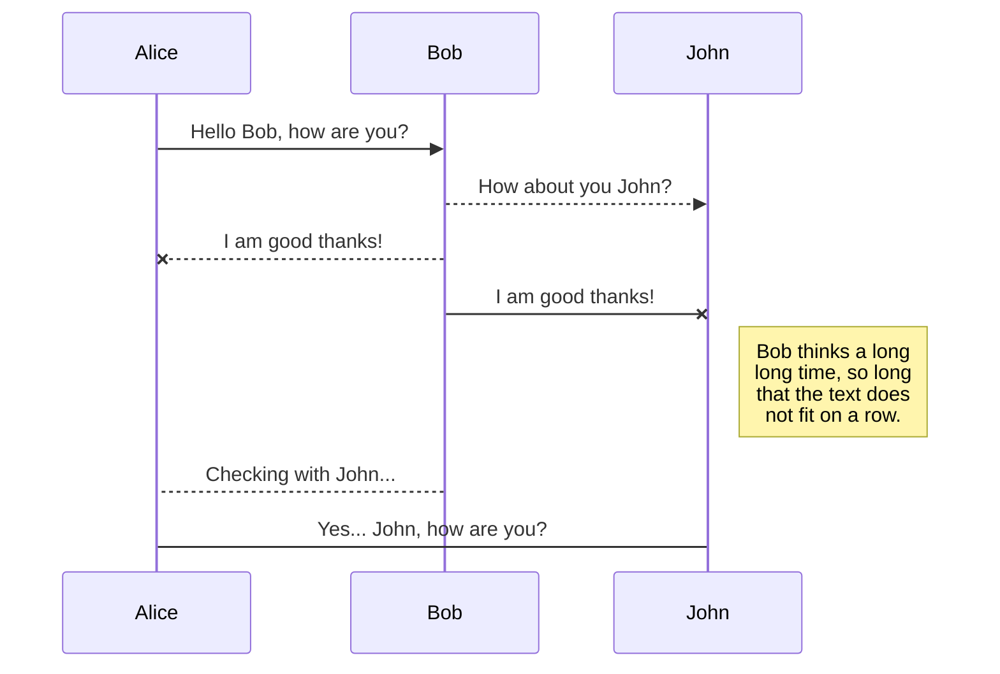
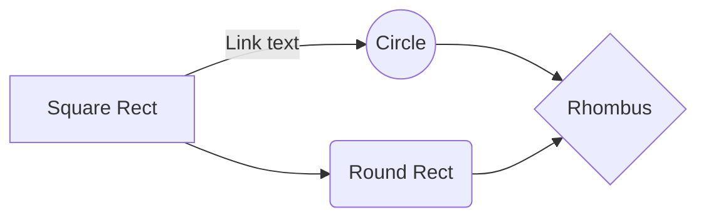

# CS 560: Lane Line Detection

## Abstract (To Be Added)

## Introduction
&emsp;One of the most pressing challenges faced in the journey to self-driving cars, is lane detection. While identifying roads is a trivial task for humans, it is a far more difficult task for autonomous vehicles. The goal of lane line detection is primarily to serve as a path planning tool as well as a safety tool for lateral control systems in autonomous vehicles. There are many obstacles that must be overcome when implementing such a system, including the different road line types, edges without lines, different road materials, lighting conditions, and environmental hazards. Implementing a system that takes into account these factors is crucial, so that a high enough safety threshold can be achieved to make the system a viable product. 
&emsp;There are two main sensors used for the purpose of detecting lane lines, front facing cameras and LiDARs. Front facing cameras, use edge detection from images to track lane lines, whereas LiDARs use the differences in the reflection from lane lines and the road to detect the lane lines. Each sensor comes with benefits and drawbacks. 
## Related Works
## Approach
## Assumptions (To Be Added)
## Results (To Be Added)
## Conclusion (To Be Added)
## Link to presentation video (To Be Added)

## UML diagrams

You can render UML diagrams using [Mermaid](https://mermaidjs.github.io/). For example, this will produce a sequence diagram:

And this will produce a flow chart:

