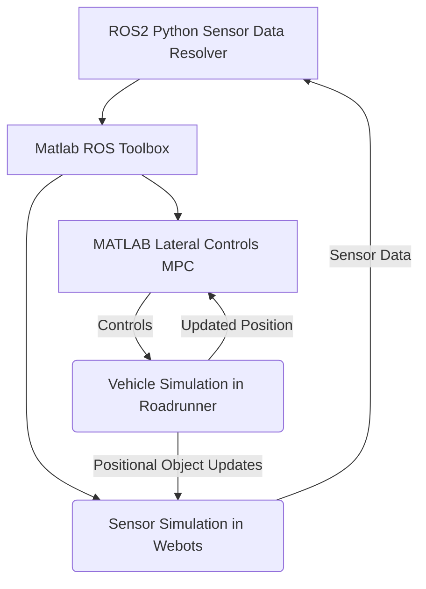

# CS 560: Lane Line Detection

## Abstract (To Be Added)

## Introduction
&emsp;One of the most pressing challenges faced in the journey to self-driving cars, is lane detection. While identifying roads is a trivial task for humans, it is a far more difficult task for autonomous vehicles. The goal of lane line detection is primarily to serve as a path planning tool as well as a safety tool for lateral control systems in autonomous vehicles. There are many obstacles that must be overcome when implementing such a system, including the different road line types, edges without lines, different road materials, lighting conditions, and environmental hazards. Implementing a system that takes into account these factors is crucial, so that a high enough safety threshold can be achieved to make the system a viable product. 

&emsp;The purpose of this project is to identify the best sensors to use for lane line detection for UA's EcoCAR team. The CAV (Connected Autonomous Vehicles) subteam is focused on developing autonomous features for the car, including lateral controls based on lane line detection. The modified car, a 2023 Cadillac Lyriq has several limitations that must be taken into account. First, there is a total limit of the compute resources and power draw that can be used, as a result of the EcoCAR competition's rules. Second, complexity must be taken into account, as a less complex system is necessary in order to ensure that the algorithm can be easily debugged and integrated with other systems that need lateral controls like the autonomous intersection navigation and auto park algorithms. Finally, the lateral controls must be robust enough to stand up to the vehicle technical specifications, including at least a 99% accuracy with lane detection and path planning. Choosing the right sensor for this problem is thus critical for the success of the team's work on lateral control algorithms.

&emsp;There are two main sensors used for the purpose of detecting lane lines, front facing cameras and LiDARs. Front facing cameras, use edge detection from images to track lane lines, whereas LiDARs use the differences in the reflection from lane lines and the road to detect the lane lines. Each method comes with its own strengths and drawbacks.

&emsp;LiDAR sensors are sensors that measure the time light takes to bounce off of an object to generate data. LiDAR is a time of flight (TOF) sensor, which in effect means the data received from the sensor is a 3d map of the environment. When LiDAR is used for lane line detection, it relays accurate information about the distance of the data it receives, which allows for better path planning. LiDAR works well in a variety of lighting conditions, which also makes it a good choice for lane line detection. LiDAR sensors also have some drawbacks. One chief problem with LiDAR sensors is that they generate a large volume of data to be processed every second, this in effect means that they require large amounts of computing power to be used effectively. They also are very expensive, creating a barrier to entry for cheaper automotive systems. LiDAR sensors also have key issues with weather effects that limit light travel, making them a poor choice in adverse weather conditions like fog. 

&emsp;Forward facing cameras, are often situated on the front of vehicles, either integrated into the grill, or attached where the rearview camera is. Forward facing cameras use computer vision algorithms for edge detection to identify lane lines. While this means they need a large amount of compute power for training, they typically need far less for inferencing. Forward facing cameras are also capable of depth perception, but in order for that to work, two cameras are need to be set up in stereo to calculate distances. Cameras work well with an unobstructed line of sight and are far cheaper than LiDARs which is a major advantage to them. They have more difficulties in low light environments than LiDARs, and also struggle in adverse weather conditions. 

&emsp;The option to use multiple technologies also exists, but it comes with a few drawbacks specific to the operational design domain. The CAV compute platform has a maximum energy draw, and the resources must be used by other algorithms like the sensor fusion algorithms. Thus, an analysis of the strain on resources must be taken into account in the decision-making process. Additionally, considerations must be made in accordance to the added cost per increase in effectiveness by implementing a mixed approach from both a developmental and hardware perspective.
## Related Works
- 
## Approach

### Sensor Software Setup:

## Assumptions (To Be Added)
## Results (To Be Added)
## Conclusion (To Be Added)
## Link to presentation video (To Be Added)

